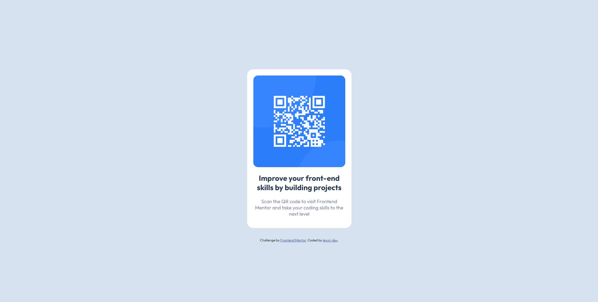

# Frontend Mentor - QR code component solution

This is a solution to the [QR code component challenge on Frontend Mentor](https://www.frontendmentor.io/challenges/qr-code-component-iux_sIO_H). Frontend Mentor challenges help you improve your coding skills by building realistic projects.

## Table of contents

- [Overview](#overview)
  - [Screenshot](#screenshot)
  - [Links](#links)
- [My process](#my-process)
  - [Built with](#built-with)
  - [Useful resources](#useful-resources)
- [Author](#author)

## Overview

### Screenshot

### Links

- Solution URL: 
- Live Site URL: 

## My process

### Built with

- Semantic HTML5 markup
- CSS custom properties
- Flexbox

### Useful resources

- [Hide content](https://www.a11yproject.com/posts/how-to-hide-content/) - This helped me for hiding a content visually but can still be read by screen readers. I got this from Kevin Powell

## Author

- Website - [levvii-dev](https://levvii-dev.github.io/)
- Frontend Mentor - [@levvii-dev](https://www.frontendmentor.io/profile/levvii-dev)
